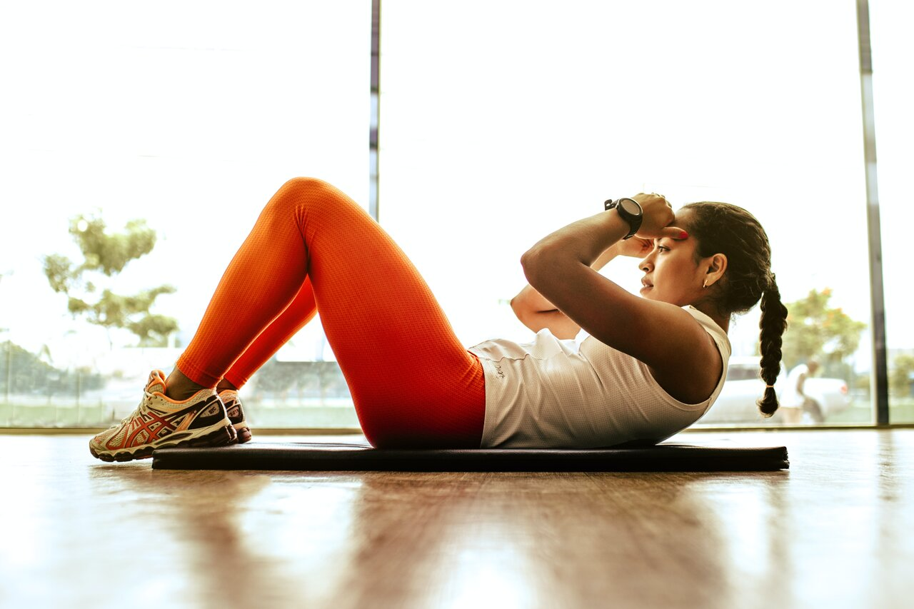

# Why Private Gyms Are More Hygienic For Your Fitness Journey

<figure><figcaption>
Photo by<a href="https://unsplash.com/@jonathanborba?utm_source=unsplash&#x26;utm_medium=referral&#x26;utm_content=creditCopyText"> Jonathan Borba</a>
</figcaption></figure>

Are you tired of rubbing elbows with sweaty strangers at your local gym? Look no further, fitness enthusiasts! Private gyms are the new black. And we're not just talking about fancy boutique gyms with overpriced memberships. We’re talking about affordable, personalized, and most importantly, clean private gyms in Salt Lake City. Say goodbye to germy equipment and hello to a personalized fitness journey. In this blog, we'll explore why private gyms are the answer to your hygienic gym prayers. So put on your workout gear and let's get started!

### Private gyms offer a personal space

Gyms have some of the highest risk for germs and bacteria. Much of this is caused by others in the gym. Research has found that the body naturally lowers immune system function after an intense workout. This means that during or after your workout, you’re more susceptible to the cold that the obnoxious deadlifter just caught.

Working out at private gyms allow you to workout in a private space, without having to worry about the sicknesses that others may have. You won’t have to worry about the sweat stains that haven’t been wiped down, or if anyone around you might have anything transmittable. You can finally work out in peace. With a private gym, you have the assurance that the space is solely dedicated to you, and will not give you anything you weren’t looking for (other than gains, of course).

### Better cleaning procedures

There is nothing worse than going to use a machine that has sweat stains all over it. According to research done by[ FitRated.com](https://www.fitrated.com/resources/examining-gym-cleanliness/), free weights at the gym contain 362 times the amount of germs than on a toilet seat. If that upsets you, wait till you hear how much is on treadmills (we’ll save you the grief).

In a private gym, you can rest assured that the equipment and facilities are clean, everytime. Since it's a smaller space, private gym owners can easily wipe down and clean everything a lot more easily than at a commercial gym. At Gym2Gym, we make sure that our gyms and gym owners are always keeping their facilities clean. We hold our private gyms to a high standard, and make sure that they always exceed your expectations. Learn more about how you can get started with a Gym2Gym private gym today here!

### Conclusion

Private gyms are a hygienic and personalized option for fitness enthusiasts looking for a safe and clean workout space. Whether you're concerned about germs, looking for customization, or simply want more control over your fitness journey, private gyms offer a solution. So what are you waiting for? Take control of your fitness journey and book a private gym today.

\
